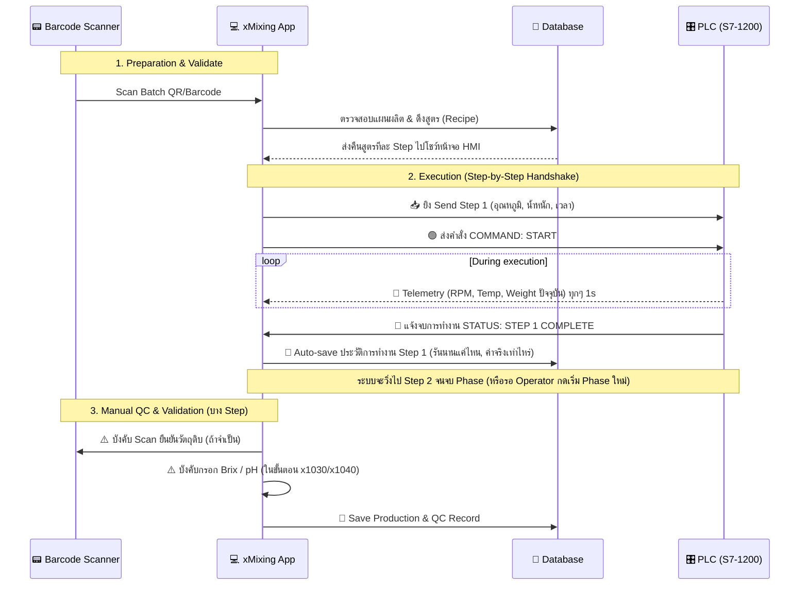

# 📖 Work Instruction & Data Flow (xMixing Control)

เอกสารระบุลอจิกการทำงานและคู่มือปฏิบัติงาน (Work Instruction - WI) สำหรับ Operator ตลอดจนการทำงานร่วมกันระหว่าง **Scanner** ↔ **xMixing App** ↔ **PLC**

---

## 1. 🔄 Data Flow Architecture (การรับส่งข้อมูล)

ระบบจะถูกขับเคลื่อนด้วย **"คน" เป็นผู้คุมจังหวะ** และ **"PLC" เป็นผู้ลงมือทำ**

---

## 2. 📝 Work Instruction (WI) ขั้นตอนการปฏิบัติงานของ Operator

### **🗂 ขั้นตอนที่ 1: การรับแผนและตั้งค่าเริ่มต้น (Preparation) **
1. Operator เข้าสู่ระบบ (Login) ที่หน้าจอ HMI บนเครื่องจักร **Mixing Plant**
2. ไปที่เมนู **"Check for Production (x60)"**
3. เตรียมใบสั่งผลิต (Job Order)
4. ยก **Scanner** ขึ้นแสแกน QR Code/Barcode ที่อยู่บนใบสั่งผลิต
   - *ถ้าระบบหา Batch เจอ -> จะแสดงรายละเอียดสูตร (SKU), น้ำหนักที่ต้องการผลิตทางฝั่งขวา*
   - *ช่องสีเทา/สีฟ้าจะแยก Phase ให้อ่านง่าย*
5. ตรวจสอบชื่อสูตรและปริมาณให้ตรงกับใบจริง
6. กดปุ่ม **[GO TO PRODUCTION CONTROL]** ด้านขวาล่างเพื่อเข้าสู่หน้าคุมเครื่อง (`x61`)

### **⚙️ ขั้นตอนที่ 2: เริ่มต้นรันเครื่องจักร (Start Batch)**
1. ในหน้า **Mixing Control (x61)** หน้าจอจะแสดงหน้าปัดควบคุม (Gauges) เป็นค่า 0 
2. ตรวจสอบสถานะว่าป้ายข้างๆ โชว์คำว่า **🟢 PLC CONNECTED**
3. แจ้งพนักงานห้องเตรียมวัตถุดิบ หรือตรวจเช็คส่วนหน้าให้พร้อม (ระบบพร้อมโหลดน้ำ / น้ำตาลทราย)
4. กดปุ่ม ▶️ **[START]** สีเขียวตรง Command Center 
5. แอปฯ จะโยน **Step ที่ 1** ลงไปหา PLC และ PLC จะเริ่มทำงานทันที (ดึงน้ำ, ดันอุณหภูมิ)
6. Operator เฝ้าดูหน้าจอบอกสถานะ **Actual vs Setpoint** 
   - *ไม่ต้องกด Start ทุกๆ Step ภายใน Phase* — PLC กับ App จะคุยกันเองว่าส่งของถูกไหม

### **⏸ ขั้นตอนที่ 3: กรณีฉุกเฉินหรือหยุดกลางคัน (Pause / Abort)**
- หากต้องการดูอาการ หรือตรวจเช็คคุณภาพถัง แตะ ⏸ **[PAUSE]**
  - *PLC จะพักการปั่น และหยุดนับเวลา แต่จะไม่เคลียร์ค่า*
  - หากพร้อมทำต่อ กด ⏸ อีกครั้ง เพื่อทำต่อจากจุดเดิม
- หากสูตรผิด หรือเครื่องพัง ให้กด 🛑 **[ABORT]** สีแดง 
  - *ระบบจะหยุดจ่ายไฟ และทำการล้างค่าในระบบ Operator ต้องไปยกเลิก Batch และออกหมายเหตุ*

### **🧪 ขั้นตอนที่ 4: การเติมส่วนผสมย่อย (Manual Dosing) & ใส่ค่า QC**
1. ใน **Phase การละลายสาร (D1010/D1030)** ที่หน้าจอจะโชว์ว่าให้ใส่ส่วนผสมอะไร (เช่น Potassium Sorbate 0.5 kg)
2. Operator หยิบ **Scanner** มายิงบาร์โค้ดที่ถุงส่วนผสม *เพื่อยืนยันว่าหยิบไม่ผิดตัว* (Option เสริมในอนาคต)
3. เมื่อ PLC ปล่อยอุณหภูมิถึงจุด **Holding** หรือ **Cooldown (x1030, x1040)**
4. เครื่องจะหยุดรอการยืนยัน
5. Operator นำสายวัด หรือดึง Sampling ออกมาวัด **Brix** และ **pH** 
6. กรอกค่าที่วัดได้จริง ลงในช่องสี่เหลี่ยมบน HMI 
7. กด **[CONFIRM / NEXT_STEP]** วิ่งสเตปต่อไป

### **✅ ขั้นตอนที่ 5: สิ้นสุดกระบวนการ (End Batch)**
1. เมื่อครบ 35 Steps หรือจนกว่าครบทุก Phase ระบบจะขึ้นแจ้งพุชป๊อปอัป **"🎉 BATCH COMPLETE"**
2. ระบบจะบันทึก Log ลง Database พร้อมทำรายงาน
3. Operator กดเปิดหน้าปัดล้างถังกวน หรือปั๊มออกไปยังถัง Holding ถัดไป
4. สิ้นสุดงาน (สามารถกดปริ้นท์ Log ท้ายกะได้จากปุ่ม 🖨 ปริ้นท์ด้านบนขวา) 

---

## 3. สรุปความรับผิดชอบ (Who does what?)

| ผู้รับผิดชอบ | หน้าที่ |
|--------------|---------|
| 🧑‍🔧 **Operator** | สแกน Job Order, กด START, เฝ้าระวังจอ (Monitor), ใส่ส่วนผสมมือ (Manual Dosing), กรอกค่า QC, ตัดสินใจกด STOP ฉุกเฉิน |
| 💻 **xMixing App** | โหลดสูตร, แยกเป็น Step, ยิง Step ไป PLC, รับแจ้งจบ Step แล้วอัพโหลดใส่ Database (รันอัตโนมัติ 80%), ตรวจสอบ Tolerance อาราม |
| 🎛️ **PLC** | อ่านค่าน้ำหนักเครื่องชั่ง, หมุนปั๊ม, จ่ายสตรีมให้ร้อน, คุม High Shear ตาม Step ที่รับมา |
| 📟 **Scanner** | ลด Human Error ด้วยการสแกนเลขโค้ด / สแกนหลอดส่วนผสมก่อนโยนลงถัง |
