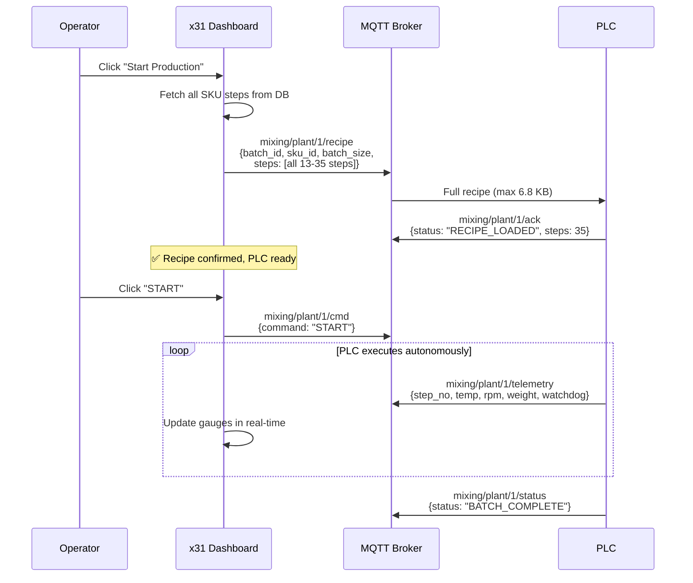

# 📊 SKU Recipe Analysis — All 16 Active SKUs

## 1. Full SKU Breakdown

| SKU ID | Product Name | Steps | Phases | Max Steps/Phase | Avg Steps/Phase |
|--------|-------------|:-----:|:------:|:---------------:|:---------------:|
| S77S743200 | Cafe Amazon | **13** | 7 | 5 | 1.9 |
| SFMU5USN00 | Fresh Mint Senorita 750ml | **15** | 8 | 4 | 1.9 |
| S7GCA4SNA0 | Japanese Melon Senorita 1900ml | **17** | 8 | 8 | 2.1 |
| S7GU5USN00 | Japanese Melon Senorita 750ml | **17** | 8 | 8 | 2.1 |
| S7KCY4SNA0 | Coconut Senorita 1900ml | **17** | 9 | 4 | 1.9 |
| S7KU5USN00 | Coconut Senorita 750ml | **17** | 9 | 4 | 1.9 |
| S77CY4SN00 | Classic Caramel Senorita | **18** | 9 | 6 | 2.0 |
| SFLDBUSS00 | Rose Senorita Signature 720ml | **24** | 10 | 7 | 2.4 |
| S7EFRU4200-1 | Strawberry Freshy 710ml x12 | **30** | 15 | 5 | 2.0 |
| S7EFSU4200 | Strawberry Freshy 710ml x3 | **30** | 15 | 5 | 2.0 |
| S7HFRU4200 | Orange Freshy 710ml x12 | **31** | 12 | **15** | 2.6 |
| S7CFSU4200 | Blue Lemon Freshy 710ml x3 | **32** | 17 | 5 | 1.9 |
| S7DFRU4200 | Lychee Freshy 710ml x12 | **34** | 16 | 5 | 2.1 |
| S7DFSU4200 | Lychee Freshy 710ml x3 | **34** | 16 | 5 | 2.1 |
| S7YFRU4200 | Green Apple Freshy 710ml x12 | **34** | 18 | 5 | 1.9 |
| SFGFSU4200 | Blue Hawaii Freshy 710ml x3 | **35** | 17 | 5 | 2.1 |

---

## 2. Statistical Summary

```
┌─────────────────────────────────────────────────┐
│          16 SKUs Analyzed                       │
├─────────────────────┬───────┬───────┬───────────┤
│ Metric              │  Min  │  Max  │    Avg    │
├─────────────────────┼───────┼───────┼───────────┤
│ Steps per SKU       │  13   │  35   │   24.9    │
│ Phases per SKU      │   7   │  18   │   12.1    │
│ Max steps in 1 phase│   -   │  15   │    -      │
│ Avg steps per phase │  1.9  │  2.6  │   2.1     │
└─────────────────────┴───────┴───────┴───────────┘
```

---

## 3. Phase Type Classification

พบ 3 ประเภท Phase ในทุก SKU:

| Prefix | Type | หน้าที่ | ตัวอย่าง |
|:------:|------|---------|----------|
| **A** | **Auto Batching** | ชั่งตวงวัตถุดิบอัตโนมัติ (น้ำ, น้ำตาล, LS) | A1010, A1020 |
| **D** | **Dissolve / Mix** | ละลาย, ผสม, ต้ม, เติมวัตถุดิบมือ | D1010, D1030 |
| **x** | **Transfer / Control** | โอนย้ายถัง, รอ, QC, จบกระบวนการ | x1010, x1020, x1030, x1040 |

### Process Flow Pattern (พบในทุก SKU):


---

## 4. Payload Size Analysis

| Method | Worst Case | Typical | Comment |
|--------|-----------|---------|---------|
| **Send ALL** | 35 steps × 200B = **6.8 KB** | 25 × 200B = **4.9 KB** | เล็กมาก! |
| **Send per Phase** | 15 steps × 200B = **2.9 KB** | 2 × 200B = **0.4 KB** | เล็กเกินไป |
| **Send per Step** | 1 × 200B = **0.2 KB** | - | ไม่คุ้ม overhead |

> [!IMPORTANT]
> **ข้อมูลสำคัญ**: Payload ของสูตรที่ใหญ่ที่สุด (35 steps) มีขนาดเพียง **6.8 KB** เท่านั้น — **เล็กมากๆ** สำหรับ PLC สมัยใหม่ที่มี memory เป็น MB ขึ้นไป

---

## 5. 🏆 คำแนะนำ: **Send ALL (Option A)**

### เหตุผล:

| # | เหตุผล | รายละเอียด |
|---|--------|-----------|
| 1 | **Payload เล็กมาก** | แม้ SKU ที่ซับซ้อนสุด (35 steps) ก็แค่ 6.8 KB — PLC รับได้สบายๆ |
| 2 | **Avg 2.1 steps/phase** | ถ้าส่งทีละ Phase จะต้อง handshake 12-18 ครั้ง เปลืองเกินไป |
| 3 | **PLC ทำงานอิสระ** | ไม่ต้องรอ Network ระหว่างขั้นตอน — **ปลอดภัยกว่า** สำหรับโรงงาน |
| 4 | **ง่ายต่อการ Debug** | ส่งครั้งเดียว ตรวจสอบว่าครบถ้วน แล้ว PLC วิ่งต่อเอง |
| 5 | **Network Failure Safe** | ถ้าเน็ต MQTT หลุดระหว่างผลิต PLC ยังวิ่งต่อได้ |

### Architecture ที่แนะนำ:



### MQTT Topic Design (Final):

```
mixing/plant/{id}/
├── recipe          # HMI → PLC: Full recipe download (ALL steps)
├── cmd             # HMI → PLC: START, PAUSE, RESUME, ABORT
├── ack             # PLC → HMI: Recipe loaded / Command acknowledged
├── telemetry       # PLC → HMI: Real-time sensor data (every 1-2s)
├── status          # PLC → HMI: RUNNING, PAUSED, COMPLETE, ERROR
└── watchdog        # PLC → HMI: Heartbeat counter
```

### Recipe JSON Schema:

```json
{
  "batch_id": "P260411-02-01-001",
  "sku_id": "S77S743200",
  "sku_name": "Cafe Amazon",
  "batch_size": 1200.0,
  "plant_id": 1,
  "total_steps": 13,
  "total_phases": 7,
  "timestamp": "2026-04-15T16:40:00",
  "steps": [
    {
      "step_no": 10,
      "phase": "p0010",
      "phase_id": "A1010",
      "action_code": "10030",
      "re_code": "LS in Line",
      "destination": "1010",
      "require": 371.71,
      "uom": "kg",
      "low_tol": 0.001,
      "high_tol": 0.001,
      "agitator_rpm": 80.0,
      "high_shear_rpm": 0.0,
      "temperature": 40.0,
      "temp_low": 0.0,
      "temp_high": 0.0,
      "step_time": 0,
      "step_timer_control": 0
    }
  ]
}
```

---

## 6. Next Steps

- [ ] Implement recipe publish in `x61-MixingControl.vue` (Send All on Start)
- [ ] Update `plc_simulator.mjs` to receive & parse full recipe
- [ ] Add recipe ACK handling in `useMQTT.ts`
- [ ] Add step progress tracking on dashboard (current step highlight)
