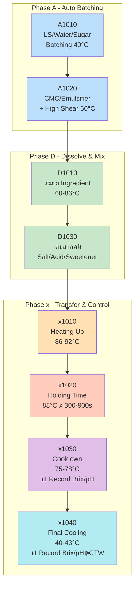
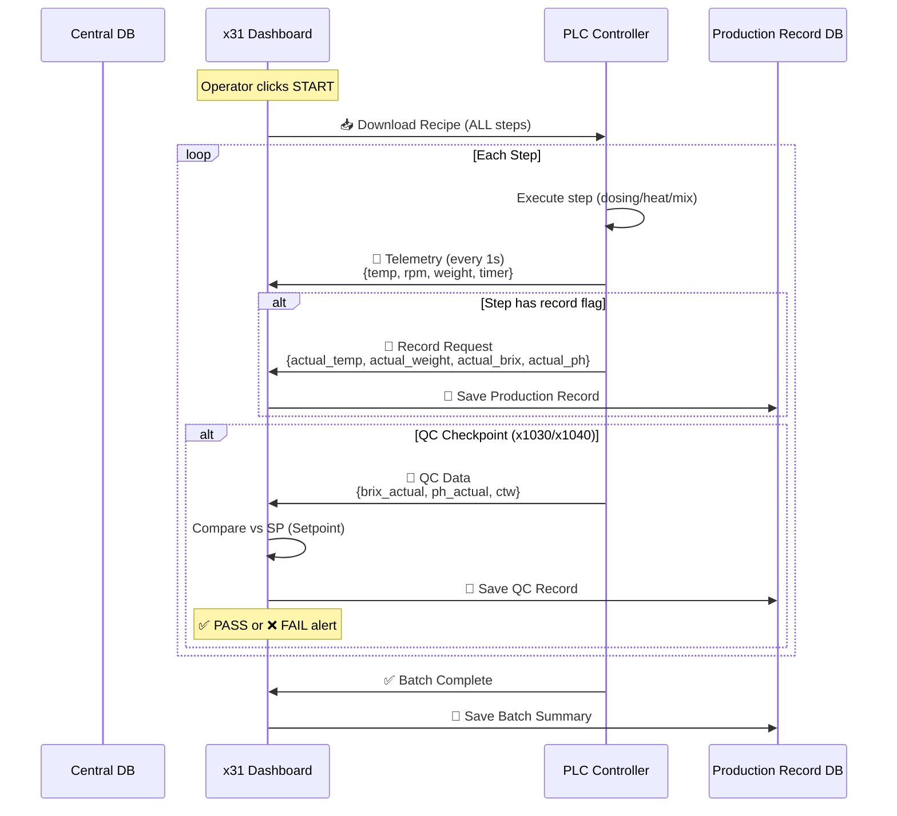

# 🏭 Process Control Concept — xMixing Production

## 1. Process Flow Overview

จากการวิเคราะห์ SKU ทั้ง 16 ตัวจริงจากฐานข้อมูล พบรูปแบบการผลิตดังนี้:



---

## 2. Temperature Zones (5 โซน)

| Zone | Phase ID | อุณหภูมิ | Range | ระยะเวลา | วัตถุประสงค์ |
|------|----------|---------|-------|----------|-------------|
| 🔵 **Mixing** | A1010 | **40°C** | - | ไม่กำหนด | ชั่งตวงวัตถุดิบหลัก (LS, Water, Sugar) |
| ⚡ **High Shear** | A1020 | **60°C** | - | 120-180s | ผสม CMC, Emulsifier + High Shear 800-1700 RPM |
| 🟠 **Heating** | x1010 | **86-92°C** | 85-95°C | ไม่กำหนด | ให้ความร้อนถึงจุดพาสเจอร์ไรส์ |
| 🔴 **Holding** | x1020 | **88°C** | 86-90°C | **300-900s** | คงอุณหภูมิฆ่าเชื้อ (Pasteurization) |
| ❄️ **Cooldown** | x1030→x1040 | **78→43°C** | 40-80°C | ไม่กำหนด | ลดอุณหภูมิ + เติม Flavour + QC Check |

### Temperature Profile Chart:
```
Temp (°C)
  92│          ┌──────────┐
  88│          │ HOLDING  │ (300-900s)
  86│     ┌────┘  x1020   └──┐
  78│     │                  └──┐ x1030 (Cooldown)
  60│  ┌──┘ Heating              └──┐
  43│  │    x1010                   └──── x1040 (Final Cool)
  40│──┘ A1010                          ❄️ + 📊 Brix/pH
    └──────────────────────────────────────── Time
     Batch   HS    Dissolve  Heat Hold Cool  Final
```

---

## 3. Motor Control (2 ระบบ)

### 3.1 Agitator (ใบกวนถังหลัก)

| สถานะ | RPM | ใช้ในขั้นตอน |
|--------|-----|-------------|
| **Low Speed** | 30 RPM | D1010, D1030 — ช่วงเติมวัตถุดิบละลาย |
| **Normal Speed** | 60 RPM | A1020 — ช่วง High Shear ทำงาน |
| **High Speed** | 80 RPM | A1010, x1010-x1040 — ช่วง Batch/Heat/Hold/Cool |

### 3.2 High Shear (เครื่องบดละเอียด)

| สถานะ | RPM | ใช้เมื่อ |
|--------|-----|---------|
| **OFF** | 0 | ส่วนใหญ่ของกระบวนการ |
| **Medium** | 800 | เติมของเหนียว (Emulsifier, Textaid) |
| **High** | 1700 | เติม CMC, สารทำให้ข้น |

> [!IMPORTANT]
> High Shear ทำงานเฉพาะ Phase **A1020** เท่านั้น! และมี **timer control** (120-180 วินาที)

---

## 4. Recording & QC Checkpoints

### 4.1 ค่าที่ต้อง Record ตลอด (ทุก Step)

| ค่า | Field | บันทึก | ประเภท |
|-----|-------|--------|--------|
| 🌡️ **อุณหภูมิ** | `qc_temp` | ✅ **ทุก Step** | Continuous |
| ♨️ **Steam Pressure** | `record_steam_pressure` | ✅ **ทุก Step** | Continuous |

### 4.2 ค่าที่ Record เฉพาะบาง Step (QC Checkpoint)

| ค่า | Field | เมื่อไหร่ | Phase ที่พบ |
|-----|-------|----------|-----------|
| ❄️ **CTW** (Cooling Tower Water) | `record_ctw` | ช่วง **Final Cooling** เท่านั้น | **x1040** |
| 📊 **Brix** | `operation_brix_record` | ช่วง **Cooldown + Final** | **x1030, x1040** |
| 🧪 **pH** | `operation_ph_record` | ช่วง **Cooldown + Final** | **x1030, x1040** |

### 4.3 QC Checkpoint Summary (จาก Blue Lemon Freshy 32 steps)

```
Step 1-23: ไม่มี Brix/pH record → เป็นขั้นตอนผลิตปกติ
Step 24 (x1030 Cooldown 78°C):  📊 Brix  🧪 pH   ← QC Check #1
Step 25-31: ไม่มี
Step 32 (x1040 Final 43°C):     📊 Brix  🧪 pH  ❄️ CTW  ← QC Check #2 (Final)
```

---

## 5. Data Flow: Recipe → PLC → Record



---

## 6. Production Record Schema

### 6.1 Per-Step Record (บันทึกทุก Step)

```json
{
  "batch_id": "P260411-02-01-001",
  "step_no": 10,
  "phase": "p0010",
  "phase_id": "A1010",
  "re_code": "LS in Line",
  
  "setpoint": {
    "require": 371.71,
    "temperature": 40.0,
    "agitator_rpm": 80.0,
    "high_shear_rpm": 0
  },
  
  "actual": {
    "weight": 371.85,
    "temperature": 40.2,
    "agitator_rpm": 79.5,
    "high_shear_rpm": 0,
    "steam_pressure": 2.5,
    "elapsed_time": 45
  },
  
  "tolerance": {
    "weight_ok": true,
    "temp_ok": true
  },
  
  "timestamp_start": "2026-04-15T10:00:00",
  "timestamp_end": "2026-04-15T10:00:45",
  "recorded_by": "PLC"
}
```

### 6.2 QC Checkpoint Record (เฉพาะ x1030/x1040)

```json
{
  "batch_id": "P260411-02-01-001",
  "checkpoint": "COOLDOWN",
  "phase_id": "x1030",
  
  "setpoint": {
    "temperature": 78.0,
    "temp_range": [75.0, 80.0],
    "brix_sp": "14.5",
    "ph_sp": "3.8"
  },
  
  "actual": {
    "temperature": 77.5,
    "brix": 14.3,
    "ph": 3.82,
    "ctw_temp": null,
    "steam_pressure": 2.1
  },
  
  "result": "PASS",
  "operator": "admin",
  "timestamp": "2026-04-15T10:15:30",
  "notes": ""
}
```

---

## 7. PLC Register Mapping Concept

### Setpoint Registers (HMI → PLC) — Written per step

| Register | Type | Description |
|----------|------|-------------|
| DB100.0 | INT | Step Number |
| DB100.2 | INT | Action Code |
| DB100.4 | REAL | Target Weight (kg) |
| DB100.8 | REAL | Temp Setpoint (°C) |
| DB100.12 | REAL | Temp Low Limit |
| DB100.16 | REAL | Temp High Limit |
| DB100.20 | REAL | Agitator RPM SP |
| DB100.24 | REAL | High Shear RPM SP |
| DB100.28 | INT | Step Time (s) |
| DB100.30 | REAL | Low Tolerance |
| DB100.34 | REAL | High Tolerance |

### Actual/Telemetry Registers (PLC → HMI) — Read every 1s

| Register | Type | Description |
|----------|------|-------------|
| DB200.0 | INT | Current Step No |
| DB200.2 | INT | Step Timer (s) |
| DB200.4 | REAL | Mixing Tank Temp (°C) |
| DB200.8 | REAL | Mixing Tank Weight (kg) |
| DB200.12 | REAL | Agitator RPM Actual |
| DB200.16 | REAL | High Shear RPM Actual |
| DB200.20 | REAL | Hopper Weight (kg) |
| DB200.24 | REAL | Steam Pressure |
| DB200.28 | REAL | CTW Temp |
| DB200.32 | INT | Watchdog |
| DB200.34 | INT | Status (0=IDLE, 1=RUN, 2=PAUSE, 3=DONE, 9=ERROR) |

### QC Registers (Operator Input or PLC Sensor)

| Register | Type | Description |
|----------|------|-------------|
| DB300.0 | REAL | Actual Brix |
| DB300.4 | REAL | Actual pH |
| DB300.8 | REAL | Actual CTW Temp |
| DB300.12 | BOOL | QC Record Trigger |
| DB300.13 | BOOL | QC Pass/Fail |

---

## 8. Implementation Plan

### Phase 1: Recipe Download ✅ (Done)
- [x] Send ALL recipe to PLC via MQTT
- [x] PLC Simulator handles recipe
- [x] Download button + ACK

### Phase 2: Step-by-Step Telemetry (Current)
- [ ] PLC simulator uses recipe SP for realistic telemetry
- [ ] Dashboard highlights active step with actual vs SP
- [ ] Step auto-advance based on step_time

### Phase 3: Production Records
- [ ] Create `production_records` table in DB
- [ ] API endpoint to save per-step records
- [ ] Auto-save actual values when step completes

### Phase 4: QC Checkpoints
- [ ] Detect QC steps (brix/ph/ctw flags)
- [ ] Show QC input dialog at x1030/x1040
- [ ] Compare actual vs SP → PASS/FAIL
- [ ] Save QC records to DB

### Phase 5: Batch Report
- [ ] Generate batch production report
- [ ] Include all step records + QC results
- [ ] Export as PDF for QA sign-off
