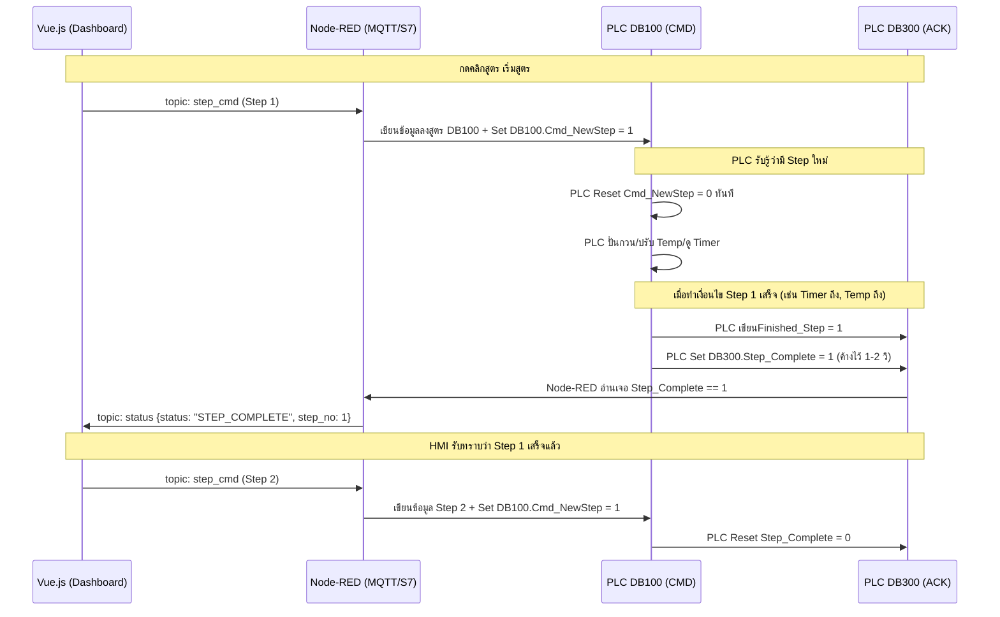

# 🧠 S7-1200 PLC Data Block & Interaction Design 
**Method: Step-by-Step Handshake (via Node-RED & MQTT)**

เนื่องจากใช้ **Siemens S7-1200** และเป็นการส่งทีละขั้น (Step-by-Step), เราจะออกแบบ **Data Block (DB)** โดยแบ่งหน้าที่ชัดเจน ป้องกันปัญหา Read/Write ชนกัน (Race Condition) ระหว่าง HMI/Node-RED กับ PLC

---

## 1. Data Block Mapping

โครงสร้างจะแบ่งออกเป็น 3 DB เพื่อความปลอดภัยในการสื่อสาร (HMI เขียน 1 DB, PLC เขียน 2 DB)

### 📥 DB100 : `DB_STEP_CMD` (HMI ➡️ PLC)
> **สิทธิ์:** HMI (ผ่าน Node-RED/OPC-UA/S7Comm) เป็นผู้เขียนเท่านั้น, PLC เป็นผู้อ่าน
> **หน้าที่:** รับค่า Parameter ของ Step ปัจจุบัน และ Command ควบคุม

| Address | Name | Data Type | ขนาด | คำอธิบายจากระบบ xMixing |
|---------|------|-----------|------|-----------------------|
| `DBW0`  | `Batch_ID` | String[20] | 22B | รหัส Batch (เช่น P260411-...) |
| `DBW22` | `HMI_Command` | Int | 2B | 0=IDLE, 1=START, 2=PAUSE, 3=ABORT, 9=RESET |
| `DBW24` | `Step_No` | Int | 2B | ลำดับ Step ปัจจุบัน |
| `DBW26` | `Phase_ID` | String[10] | 12B | เช่น A1010, D1010, x1030 |
| `DBW38` | `Re_Code` | String[20] | 22B | รหัสวัตถุดิบ / Action |
| `DBW60` | `Target_Weight` | Real | 4B | น้ำหนัก (require) |
| `DBW64` | `Temp_SP` | Real | 4B | Setpoint อุณหภูมิ (`temperature`) |
| `DBW68` | `Temp_Low`| Real | 4B | `temp_low` |
| `DBW72` | `Temp_High`| Real | 4B | `temp_high` |
| `DBW76` | `Agitator_SP`| Real | 4B | ความเร็วใบพัด (`agitator_rpm`) |
| `DBW80` | `HighShear_SP`| Real | 4B | ความเร็ว High Shear (`high_shear_rpm`) |
| `DBW84` | `Step_Time` | Int | 2B | เวลาทำ Step (`step_time` วินาที) |
| `DBX86.0` | `Cmd_NewStep`| Bool | 1b | **Trigger Bit**: HMI โหลดค่าเสร็จแล้วให้ PLC เริ่มทำ |

---

### 📤 DB200 : `DB_TELEMETRY` (PLC ➡️ HMI)
> **สิทธิ์:** PLC เป็นผู้เขียนเท่านั้น, HMI เป็นผู้อ่าน (ดึงทุก 1 วินาที)
> **หน้าที่:** แสดงสถานะจริง (Dashboard Gauge & Active Status)

| Address | Name | Data Type | ขนาด | คำอธิบาย |
|---------|------|-----------|------|----------|
| `DBW0`  | `Watchdog` | Int | 2B | PLC +1 ทุกวินาที (เช็คว่าเน็ต/PLC ยังกะพริบไหม) |
| `DBW2`  | `PLC_State` | Int | 2B | 0=Ready, 1=Running, 2=Holding, 3=Paused, 9=Error |
| `DBW4`  | `Current_Step`| Int | 2B | PLC กำลังทำ Step ที่เท่าไหร่ |
| `DBW6`  | `Step_Timer` | Int | 2B | จับเวลาจริงของ Step นี้ (วินาที) |
| `DBW8`  | `MixTank_Temp`| Real | 4B | อุณหภูมิถัง Mixing ปัจจุบัน |
| `DBW12` | `MixTank_Weight`| Real| 4B | น้ำหนักถัง Mixing ปัจจุบัน |
| `DBW16` | `Agitator_Act` | Real | 4B | RPM จริง ของใบพัดกวน |
| `DBW20` | `HighShear_Act`| Real | 4B | RPM จริง ของบดละเอียด |
| `DBW24` | `Hopper_Weight`| Real | 4B | น้ำหนัก Hopper ปัจจุบัน |

---

### 📤 DB300 : `DB_HANDSHAKE` (PLC ➡️ HMI)
> **สิทธิ์:** PLC เป็นผู้เขียน, HMI เป็นผู้อ่าน / Node-RED คอยจับ Monitor
> **หน้าที่:** การตอบโต้ (Event Trigger) ระหว่างเปลี่ยน Step

| Address | Name | Data Type | ขนาด | คำอธิบาย |
|---------|------|-----------|------|----------|
| `DBX0.0`| `Step_Complete` | Bool | 1b | **Pulse Signal**: PLC แจ้งว่าทำจบ Step แล้วให้ส่งถัดไปมาได้เลย |
| `DBW2`  | `Finished_Step` | Int  | 2B | แจ้งยืนยันว่าจบ Step_no ที่เท่าไหร่ |
| `DBW4`  | `End_Temp`     | Real | 4B | Snapshot อุณหภูมิตอนจบ Step (ไว้ทำ Report) |
| `DBW8`  | `End_Weight`   | Real | 4B | Snapshot น้ำหนักตอนจบ Step |
| `DBX12.0`| `Error_Flag`  | Bool | 1b | มีความผิดพลาดทำให้ Step หยุด (เช่น Motor Trip) |
| `DBW14` | `Error_Code`   | Int  | 2B | รหัสแสดง Error |

---

## 2. Interaction Flow Protocol (Handshake Concept)

หลักการสื่อสารคือ **"HMI เคาะให้ ➡️ PLC ทำ ➡️ PLC ดันกลับว่าเสร็จ ➡️ HMI เคาะขั้นต่อไป"** โดยใช้ Node-RED เป็นตัวกลางเชื่อม MQTT <> S7 Node.

---

## 3. Node-RED Gateway Design (MQTT ↔ S7)

ใน **Node-RED** คุณจะต้องสร้าง Flow 2 ขาหลักสำหรับ Method นี้:

### ขา HMI ส่งไป PLC (Write to DB100)
1. **MQTT In**: ฟัง Topic `mixing/plant/1/step_cmd`
2. **JSON**: แปลง Payload เป็น Object
3. **Function Node (Format Mapping)**: แมพ `msg.payload.temperature` -> `msg.payload.Temp_SP`
4. **S7 Out**: เขียนลงขั้ว `DB100` (ทั้งหมดรวดเดียว)
5. *Delay 100ms* -> **S7 Out**: บังคับเขียน `DB100,X86.0 = true` (Trigger `Cmd_NewStep`)

### ขา PLC ส่งแจ้ง HMI (Monitor DB300)
1. **S7 In (Event Mode)**: คอย Monitor ตัวแปร `DB300,X0.0` (Step_Complete)
2. **Switch Node**: เช็ค ถ้าเช็คค่าเท่ากับ `TRUE` เท่านั้นให้ไหลผ่าน
3. **S7 In (Read Multiple)**: เมื่อทริกเกอร์ ให้ไปอ่าน `Finished_Step`, `End_Temp`, `End_Weight`
4. **Function Node**: แพ็กข้อมูลใส่รูปแบบ `{status: "STEP_COMPLETE", step_no: 1, end_temp: 85.0}`
5. **MQTT Out**: ปล่อยเข้า Topic `mixing/plant/1/status`

---

## 4. Why this design fits S7-1200?

1. **Memory Efficiency**: PLC ไม่ต้องใช้ Array ขนาดใหญ่เก็บหลายๆ Steps (PLC บางตัว limit Memory)
2. **Safety First**: ใช้ Signal `Cmd_NewStep` และ `Step_Complete` เป็นตั๋วผ่านทาง (Interlock) ป้องกัน PLC ข้ามขั้นตอน
3. **Debug ง่ายใน TIA Portal**: 
   - HMI ค้าง? ดึง Watch Table ของ DB100/DB300 มาดูค่าได้ชัดเจนเลยว่าใครค้าง
   - ถ้า `Cmd_NewStep` เป็น 1 ตลอด แปลว่า PLC โปรแกรมค้าง
   - ถ้า `Step_Complete` เป็น 1 ตลอด แปลว่าฝั่ง Node-RED ไม่อ่านกลับไป
