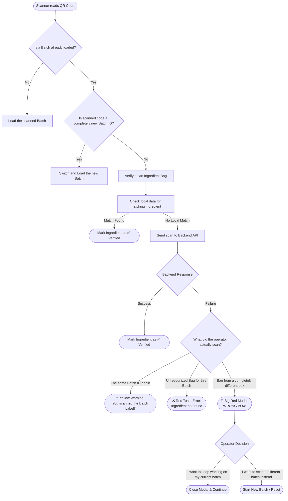

# Barcode Scanning & Verification Workflow

This diagram illustrates the step-by-step logic the application follows when an operator scans a QR code using the handheld scanner. It highlights the error-handling logic for various scanning mistakes, including the Wrong Box handling.

