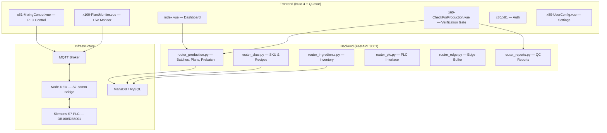
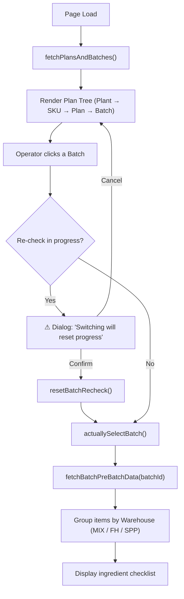
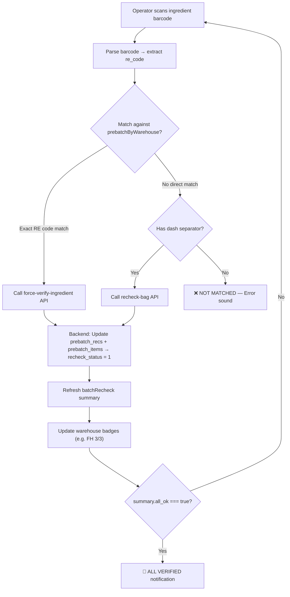
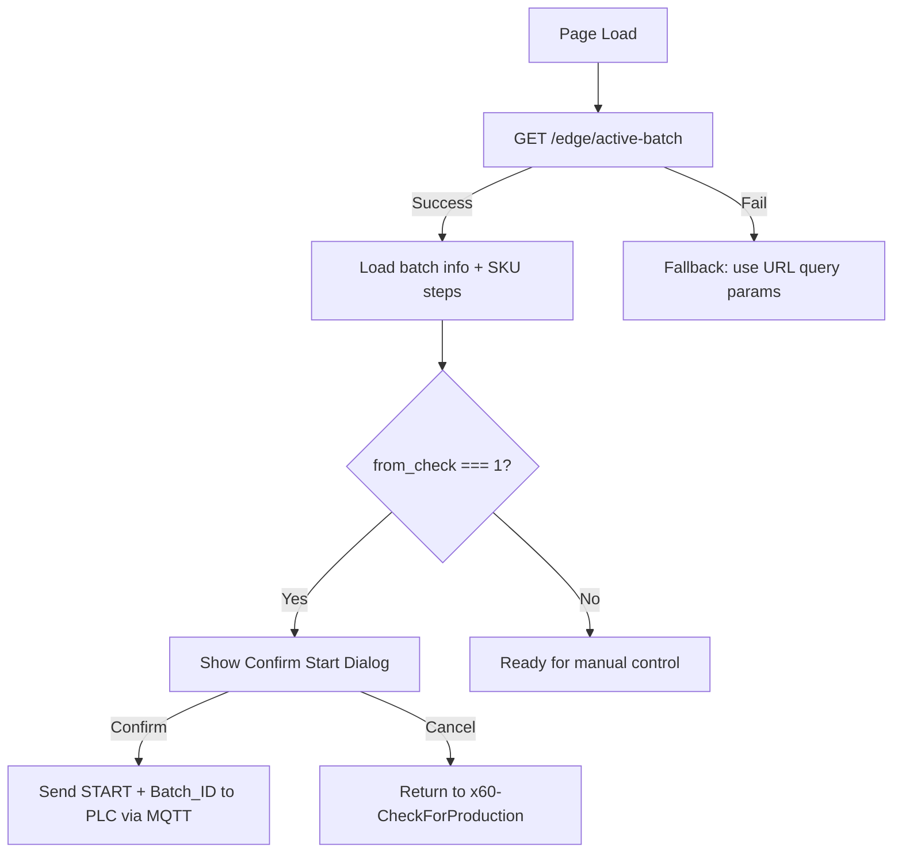
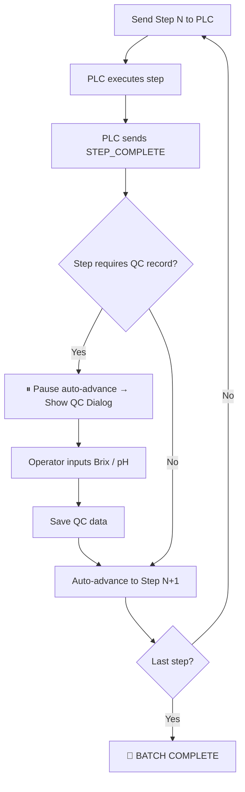
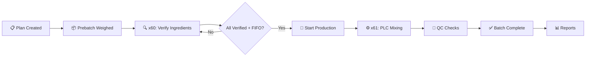

# xMixingControl — Application Workflow

> **Project:** x2512001-mitrPhol-x31-xMixingControl  
> **Version:** 2026-05  
> **Stack:** Nuxt 4 / Vue 3 / Quasar (Frontend) + FastAPI / SQLAlchemy (Backend) + MQTT / Node-RED / S7-comm (PLC Bridge)

---

## System Architecture Overview



---

## Page-by-Page Workflow

### 1. Dashboard (`index.vue`)

The landing page after login. Provides a bird's-eye view of the system.

| Section | Data Source | Purpose |
|---|---|---|
| Stat Cards | `/skus/`, `/ingredient-intake-lists/`, `/production-batches/`, `/production-plans/` | Show counts of active SKUs, stock items, pending batches, running productions |
| Recent Activities | Aggregated from SKUs, intakes, batches | Timeline of last 10 system events |
| System Status | `/server-status` | DB health, disk usage, sync status, uptime |

**Navigation:** Clicking a stat card routes to its corresponding module (e.g., Pending Batches → `/x30-PreBatch`).

---

### 2. Check For Production (`x60-CheckForProduction.vue`) — The Core Gate

This is the **critical verification checkpoint** between ingredient preparation and production execution. Nothing reaches the PLC without passing through this page.

#### 2.1 Layout (3-Panel)

| Panel | Position | Content |
|---|---|---|
| **Plan Tree** | Left sidebar | Hierarchical: Plant → SKU → Plan → Batch |
| **Ingredient Verification** | Center | Warehouse-grouped ingredient checklist with scan input |
| **SKU Process Steps** | Right | Recipe step table (read-only preview) |

#### 2.2 Batch Selection Flow



#### 2.3 FIFO Enforcement

The system enforces **First-In-First-Out** batch ordering:

- For each plan, the system identifies the **first batch** whose status is not `Done` or `Cancelled`
- Only that batch can have its "Start Production" button enabled
- All other batches in the same plan are viewable but blocked

#### 2.4 Hold / Unhold

Operators can manually hold/unhold individual batches:

- **Hold**: Pauses a batch (with optional reason), removing it from the active queue
- **Unhold**: Releases a held batch back to `In-Progress`
- API: `PATCH /production-batches/hold/{batchId}` / `PATCH /production-batches/unhold/{batchId}`

#### 2.5 Ingredient Verification (Re-check Scanning)



**Warehouse types and behavior:**

| Warehouse | Scan Required? | Behavior |
|---|---|---|
| **MIX** | ❌ No | Auto-verified (bulk ingredients weighed at the mixing tank) |
| **FH** (Flavour House) | ✅ Yes | Each pre-weighed bag must be physically scanned |
| **SPP** (Speciality Premix) | ✅ Yes | Each pre-weighed bag must be physically scanned |

#### 2.6 Error Handling During Scan

| Scenario | Response |
|---|---|
| Wrong batch bag scanned | 🔴 Full-screen WRONG BOX alert + error buzzer + option to switch batch |
| Already verified bag | ⚠️ Warning: "DUPLICATE SCAN" |
| Unknown barcode | ❌ Error: "NOT MATCHED" |
| Weight mismatch (tolerance exceeded) | ❌ Error: "WEIGHT MISMATCH" with actual vs expected display |

#### 2.7 Reset & Session Protection

| Trigger | Action |
|---|---|
| **"Re scan" button** | Confirmation dialog → `POST /prebatch-recs/reset-batch/{batchId}` → clears all verification flags |
| **Select different batch** (mid-check) | Warning dialog → reset current → switch |
| **Navigate away** (mid-check) | Warning dialog → reset on confirm |
| **Page refresh / close** (mid-check) | `beforeunload` warning + `sendBeacon` reset |

#### 2.8 Start Production Gate

The **START PRODUCTION** button is controlled by `canStartProduction` computed property:

```
canStartProduction = selectedBatchId EXISTS
                   AND isFifoBatch(selectedBatchId) === true
                   AND batchRecheck.summary.all_ok === true
```

When clicked:
1. Calls `PATCH /production-batches/{batchId}/release`
2. Navigates to `x61-MixingControl` with `?from_check=1`

---

### 3. Mixing Control (`x61-MixingControl.vue`) — PLC Execution

This page takes over after production is released. It is the **real-time PLC command interface**.

#### 3.1 Batch Initialization



#### 3.2 PLC Communication (MQTT → Node-RED → S7)

| MQTT Topic | Direction | Purpose |
|---|---|---|
| `mixing/plant/{id}/cmd` | App → PLC | START, PAUSE, ABORT commands |
| `mixing/plant/{id}/step_cmd` | App → PLC | Step setpoint data (DB100 payload) |
| `mixing/plant/{id}/write` | App → PLC | Direct S7 memory write (e.g., Batch ID to DB5001) |
| `mixing/plant/{id}/status` | PLC → App | Step completion confirmations |
| `mixing/plant/{id}/data` | PLC → App | Live telemetry (temps, RPMs, weights) |

#### 3.3 Step Execution Payload (DB100)

Each step command sent to PLC contains:

```json
{
  "Watch_Doc": 12345,
  "Batch_ID": "P260420-02-02-014",
  "Phase_ID": "1",
  "Step_ID": 3,
  "Step_Time_SP": 300,
  "Material_ID": "MAT001",
  "Re_Code_ID": "CL009A",
  "Req_Qty": 125.5,
  "TT_SP": [65.0],
  "Agitator_Speed": 120,
  "High_Shear_SP": 3000,
  "PH_Target": 4.2,
  "Brix_Target": 12.5,
  "HMI_Command": 1,
  "Cmd_NewStep": true
}
```

#### 3.4 Step Progression



#### 3.5 Live Monitoring Columns

The step table shows **actual vs setpoint** for each parameter in real-time:

| Column | Source | Unit |
|---|---|---|
| Require (Weight) | Hopper Scale | kg |
| Temperature | Mixing Tank Sensor | °C |
| Agitator | Agitator Speed Sensor | RPM |
| High Shear | High Shear Motor | RPM |
| Brix | QC Input / Sensor | ° |
| pH | QC Input / Sensor | - |
| Timer | PLC Step Timer | seconds |

#### 3.6 Command Center

| Button | Action | PLC Effect |
|---|---|---|
| ▶ Start | Send current step to PLC | Begin mixing sequence |
| ⏸ Pause | Pause batch | Hold current state |
| ⏭ Next Step | Force advance | Skip to next step |
| ⏹ Abort | Emergency stop | Halt all operations |
| 🔧 DB Inspect | View last PLC payload | Debug tool |

---

### 4. Plant Monitor (`x100-PlantMonitor.vue`) — Read-Only Dashboard

A passive, real-time monitoring view of all 3 mixing plants via MQTT.

| Metric | Source |
|---|---|
| Current Step / Timer | `Step_no`, `Step_Timer` |
| Tank Volume | `Mixing_Tank_Volume` |
| Tank Temperature | `Mixing_Tank_Temperature` |
| Agitator Speed | `MixingTank_Agitator_Speed` |
| High Shear Speed | `HighShare_Speed` |
| Last Scan | Barcode scan telemetry |
| Connection Status | MQTT watchdog heartbeat |

---

### 5. Auth & Settings

| Page | Purpose |
|---|---|
| `x80-UserLogin` | JWT authentication |
| `x81-UserRegister` | New user registration |
| `x89-UserConfig` | User preferences, permissions, i18n language selection |

---

## Backend API Map (Key Endpoints)

### Production & Batches (`router_production.py`)

| Method | Endpoint | Purpose |
|---|---|---|
| GET | `/production-plans/?status=active` | List active plans with nested batches |
| GET | `/production-batches/awaiting-recheck` | Batches ready for verification |
| PATCH | `/production-batches/{id}/release` | Release batch to production |
| PATCH | `/production-batches/hold/{id}` | Put batch on hold |
| PATCH | `/production-batches/unhold/{id}` | Release from hold |

### Prebatch Verification (`router_production.py`)

| Method | Endpoint | Purpose |
|---|---|---|
| GET | `/prebatch-items/by-batch/{batch_id}` | Get ingredient requirements for a batch |
| GET | `/prebatch-recs/recheck-batch/{batch_id}` | Get verification summary + checklist |
| POST | `/prebatch-recs/recheck-bag` | Verify a single bag by barcode |
| POST | `/prebatch-recs/force-verify-ingredient` | Force-verify all bags for an ingredient |
| POST | `/prebatch-recs/reset-batch/{batch_id}` | Reset all verification for a batch |
| PATCH | `/prebatch-recs/{id}/recheck-status` | Toggle individual record status |

### Other Routers

| Router | Purpose |
|---|---|
| `router_skus.py` | SKU management, recipe steps |
| `router_ingredients.py` | Raw material inventory (FEFO) |
| `router_edge.py` | Edge device buffer (active batch) |
| `router_plc.py` | PLC data block read/write |
| `router_reports.py` | QC reports, batch history |
| `router_db_sync.py` | Cloud ↔ Local database sync |
| `router_translations.py` | i18n translation management |

---

## End-to-End Production Flow



| Stage | Page | Key Action |
|---|---|---|
| 1. Planning | External / Admin | Create production plan with SKU + batch size |
| 2. Prebatch | External | Weigh ingredients per recipe into labeled bags |
| 3. **Verification** | `x60-CheckForProduction` | Scan every bag → system validates → all green |
| 4. **Release** | `x60-CheckForProduction` | Click START PRODUCTION (FIFO + verified) |
| 5. **Mixing** | `x61-MixingControl` | Confirm start → PLC executes recipe steps |
| 6. **QC Gate** | `x61-MixingControl` | Record Brix/pH at designated steps |
| 7. **Complete** | `x61-MixingControl` | All steps done → batch marked complete |
| 8. **Monitor** | `x100-PlantMonitor` | Passive live view of all plants |

---

## Database Key Tables

| Table | Purpose |
|---|---|
| `production_plans` | SKU + date + plant assignment |
| `production_batches` | Individual batch instances (status, FIFO order) |
| `prebatch_reqs` | Recipe-level ingredient requirements |
| `prebatch_recs` | Individual weighed bag records |
| `prebatch_items` | Aggregated ingredient items per batch |
| `sku_steps` | Recipe process steps (phases, setpoints) |
| `ingredient_intake_lists` | Raw material stock (FEFO managed) |

---

## Sound & UX Feedback System

The verification screen provides multi-sensory feedback:

| Event | Visual | Audio |
|---|---|---|
| Successful scan | ✅ Green flash overlay | Configurable: beep / double_beep / chime / ding |
| Failed scan | ❌ Red flash overlay | Configurable: buzzer / siren / horn / alarm |
| Wrong batch bag | 🔴 Full-screen red alert (3.5s) | Special wrong_box sound |
| All verified | 🎉 Center notification | Success chime |
| Duplicate scan | ⚠️ Warning notification | Warning tone |
