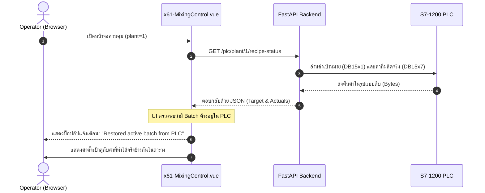

# แผนการทดสอบ: การตรวจสอบฟังก์ชัน Restore ของ PLC (DB15x7 / DB15x1)

เอกสารฉบับนี้สรุปขั้นตอนการตรวจสอบเพื่อทดสอบการกู้คืนเซสชันและการ Restore ข้อมูลการผลิตของหน้าจอ **xMixing Control** ร่วมกับระบบ PLC (ทั้งเครื่องจริงและเครื่องจำลอง)

---

## 📋 สิ่งที่ต้องเตรียมก่อนทดสอบ (Prerequisites)

### กรณี A: การทดสอบร่วมกับ PLC เครื่องจริง (เปิดใช้งานอยู่ขณะนี้)
1. **PLC เครื่องจริง:** ออนไลน์ที่ไอพี `192.168.21.210` (พอร์ต `102`)
2. **FastAPI Backend:** รันอยู่ที่พอร์ต `8031` ของเครื่อง `100.112.193.2` โดยตั้งค่าคอนฟิก `PLC_IP=192.168.21.210` ในไฟล์ `.env`
3. **Nuxt Frontend:** รันอยู่ที่พอร์ต `3031` ของเครื่อง `100.112.193.2`

### กรณี B: การทดสอบร่วมกับ Mock PLC (ระบบจำลอง)
1. **Mock PLC Server:** รันที่พอร์ต `102` ของเครื่องรีโมต `100.112.193.2` (รันผ่านไฟล์ `/home/x-root/mock_plc.py`)
2. **FastAPI Backend:** รันอยู่ที่พอร์ต `8031` ของเครื่อง `100.112.193.2` โดยตั้งค่าคอนฟิก `PLC_IP=127.0.0.1` ในไฟล์ `.env`

---

## 🛠️ ขั้นตอนการทดสอบแบบทีละสเต็ป (Test Steps)

### ส่วนที่ 1: การตรวจสอบฝั่ง API (Backend & PLC)

ตรวจสอบว่าระบบ Backend สามารถเชื่อมต่อสื่อสารเพื่ออ่านค่าผลลัพธ์จริงจาก PLC ได้อย่างถูกต้อง

| ขั้นตอน | การดำเนินการ | ผลลัพธ์ที่คาดหวัง | สถานะ |
| :--- | :--- | :--- | :---: |
| **1.1** | เรียกใช้ API ตรวจสอบสถานะ: `GET http://100.112.193.2:8031/plc/plant/1/recipe-status` | ระบบส่งคืน HTTP Status `200` พร้อมค่า `success: true` และข้อมูล Actuals ในฝั่ง `actual` | `[x]` |
| **1.2** | ตรวจสอบการอัปเดตของตัวแปร Watchdog | ค่าในฟิลด์ `watchdog` ของ API มีการเปลี่ยนแปลงเพิ่มขึ้นเรื่อย ๆ ทุกครั้งที่รีเฟรช | `[x]` |

---

### ส่วนที่ 2: การทดสอบหน้าจอใช้งานจริง (UI Manual Testing & Restore)

ตรวจสอบว่าหน้าจอเว็บแสดงป๊อปอัปแจ้งเตือนให้กู้คืนข้อมูลโดยอัตโนมัติ และแสดงตารางเปรียบเทียบค่า Target vs Actual ได้ถูกต้อง

#### วิธีดำเนินการทดสอบ:

1. **เปิดบราวเซอร์เข้าสู่ระบบหน้าเว็บควบคุม:**
   เข้าไปที่ URL: `http://100.112.193.2:3031/x61-MixingControl?plant=1`

2. **ตรวจสอบการกู้คืนสถานะการทำงานอัตโนมัติ (Auto-restore):**
   * **การทำงาน:** เมื่อหน้าจอถูกโหลด จะมีการยิง API ไปเช็กที่หลังบ้านทันที
   * **ป๊อปอัปแสดงผล:** สังเกตที่ป๊อปอัปสีฟ้า (Notification) ด้านบนจอ จะต้องขึ้นแจ้งเตือนทำนองว่า:
     > ℹ️ *Restored active batch [BATCH_ID] from PLC.*
   * **ข้อมูลหัวการผลิต:** รหัส Batch (`selectedBatchId`) และรหัส SKU (`selectedSkuId`) จะต้องถูกโหลดคืนกลับขึ้นมาให้เหมือนเดิม

3. **ตรวจสอบความถูกต้องของข้อมูล Target vs. Actual ในตาราง:**
   * ตรวจสอบดูตารางขั้นตอนการผลิต (Step Execution Table)
   * สำหรับขั้นตอนที่ผลิตเสร็จไปแล้ว (Completed Steps) จะต้องดึงค่าผลผลิตจริงจาก **DB15x7** (เช่น น้ำหนักจริง, อุณหภูมิจริง, ความเร็วรอบจริง, ค่า Brix จริง, ค่า pH จริง) มาแสดงอยู่ในช่อง Actual ถัดจาก Target ของขั้นตอนนั้น ๆ
   * **เวลาที่ใช้ไป (Elapsed Time):** จะต้องถูกแปลงและจัดรูปแบบเป็น `นาที:วินาที` อย่างถูกต้อง (เช่น 120 วินาที แสดงเป็น `2:00`)

4. **ตรวจสอบการทำงานของปุ่ม Force Restore:**
   * กดปุ่ม **"Force Restore Session"** บนหน้าจอควบคุม
   * **ผลลัพธ์:** ตัวหน้าจอจะรีโหลดข้อมูลจากหลังบ้านใหม่ และแสดงข้อความกู้คืนสถานะสำเร็จอีกครั้ง

---

## 🔍 รายการตรวจสอบความถูกต้อง (Verification Checklist)

- [ ] หลังบ้านส่งคืนสถานะ `success: true` พร้อมข้อมูลประวัติขั้นตอนจาก DB15x7 ครบถ้วน
- [ ] หน้าเว็บเรียกใช้ฟังก์ชัน `restoreBatchFromPlc` โดยอัตโนมัติเมื่อโหลดหน้า
- [ ] ปรากฏกล่องแจ้งเตือน (Notification) ยืนยันการกู้คืนข้อมูลสำเร็จ
- [ ] ข้อมูล Actuals (น้ำหนัก, อุณหภูมิ, ความเร็วรอบ, Brix, pH) แสดงผลตรงกับค่าบน PLC จริง
- [ ] จัดรูปแบบเวลาในขั้นตอนเสร็จสิ้นอย่างถูกต้อง

