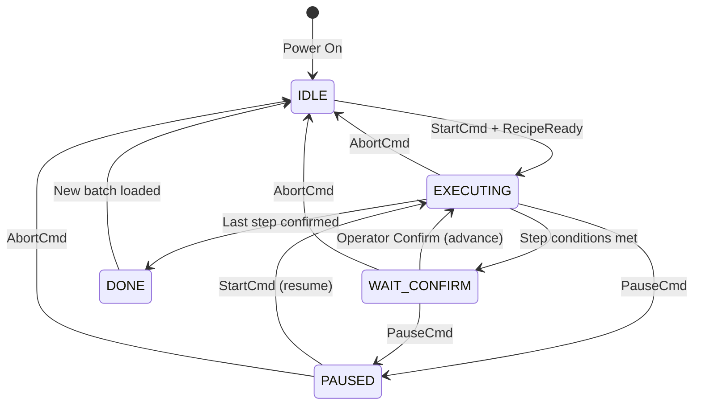

# Final Workflow — PLC Mixing Control System (V2)

> **Version:** 1.0 — May 2026  
> **System:** xMixing Control — Mitr Phol  
> **Architecture:** PLC as Executor, PC as Supervisor with Step Confirmation

---

## 1. System Architecture

```
┌───────────────┐    ┌──────────────┐    ┌──────────────┐    ┌─────────────┐
│  Nuxt (V2)    │◄──►│  FastAPI      │◄──►│  Node-RED    │◄──►│ Siemens PLC │
│  Browser UI   │ ws │  Backend     │amqp│  Middleware   │ s7 │ S7-1200/1500│
│  Port 3000    │    │  Port 8023   │    │  Port 1880   │    │ 192.168.x.x │
└───────────────┘    └──────────────┘    └──────────────┘    └─────────────┘
       │                    │                    │                    │
       │              RabbitMQ (AMQP)      S7 Protocol          Field I/O
       │              Port 5672/1883       Port 102             Sensors
       │                    │                    │              Actuators
       ▼                    ▼                    ▼                    ▼
   Operator            Database             Bridge              Physical
   Interface           MySQL              PLC ↔ App             Process
```

### Role of Each Component

| Component | Role | Stateful? |
|-----------|------|-----------|
| **PLC** | Executes steps, holds state, controls outputs (agitator, heater, valves) | ✅ Yes — **State Master** |
| **Node-RED** | Bridges PLC ↔ RabbitMQ. Polls PLC every 500ms, publishes changes | ❌ No — Stateless bridge |
| **FastAPI** | Formats recipes, logs to DB, broadcasts WebSocket to UI | ❌ No — Event-driven |
| **Nuxt (V2)** | Displays live state, provides confirm buttons for operator | ❌ No — Stateless viewer |
| **RabbitMQ** | Message broker between all components | ❌ No — Transport only |

---

## 2. Complete Workflow — Step by Step

### Phase A: Batch Setup (Before Production)

```
Step A1 ──► Step A2 ──► Step A3 ──► Step A4
Planning    PreBatch    Check       Navigate
            Weighing    Verify      to Mixing
```

| Step | Who | Action | System |
|------|-----|--------|--------|
| **A1** | Planner | Creates Production Plan with SKU, batch size, plant assignment | Nuxt → FastAPI → MySQL |
| **A2** | Warehouse | Weighs prebatch ingredients per plan, scans labels | Nuxt → FastAPI → MySQL |
| **A3** | Operator | Opens "Check for Production" page, verifies all items scanned | Nuxt reads MySQL |
| **A4** | Operator | Clicks "Start Production" → redirected to **Mixing Control V2** page | Nuxt navigation |

---

### Phase B: Recipe Download to PLC

```
┌─────────┐     ┌──────────┐     ┌──────────┐     ┌──────────┐
│ Operator │────►│ FastAPI  │────►│ Node-RED │────►│   PLC    │
│ Confirms │     │ Formats  │     │ Writes   │     │ Receives │
│ Start    │     │ Recipe   │     │ to DB1780│     │ 13 Steps │
└─────────┘     └──────────┘     └──────────┘     └──────────┘
```

| Step | Detail |
|------|--------|
| **B1** | Operator sees "Confirm Production Start" dialog with Batch ID, SKU, Batch Size |
| **B2** | Operator clicks **CONFIRM START PRODUCTION** |
| **B3** | Frontend calls `POST /plc/send-recipe/{batch_id}` |
| **B4** | FastAPI queries `sku_steps` table → builds DB1780 payload (32 phases × 8 steps) |
| **B5** | FastAPI sends payload to Node-RED HTTP endpoint |
| **B6** | Node-RED writes recipe array to PLC DB1780 via S7 protocol |
| **B7** | Node-RED writes `RecipeReady = TRUE` to PLC |
| **B8** | FastAPI sends `StartCmd = TRUE` via Node-RED → PLC |
| **B9** | PLC validates recipe, sets `PLC_State = 1` (Executing) |

---

### Phase C: Step Execution Cycle (Repeats for Every Step)

This is the **core loop** — it repeats for all 13 steps (or however many the SKU has).

```
┌──────────────────────────────────────────────────────────────────┐
│                    FOR EACH STEP (1 to N):                       │
│                                                                  │
│  ┌─────────┐    ┌───────────┐    ┌──────────┐    ┌──────────┐  │
│  │   PLC   │    │   PLC     │    │ Operator │    │   PLC    │  │
│  │Execute  │───►│Step Done  │───►│ Confirms │───►│ Advance  │  │
│  │Step N   │    │HOLD State │    │ on UI    │    │to Step   │  │
│  │State=1  │    │State=2    │    │          │    │N+1       │  │
│  └─────────┘    └───────────┘    └──────────┘    └──────────┘  │
│       │              │                │                │        │
│   Outputs ON     Outputs HOLD     Click Button    Next Step     │
│   Timer runs     Wait for PC      "CONFIRM ✅"    State=1      │
│                                                                  │
└──────────────────────────────────────────────────────────────────┘
```

#### C1. PLC Executes Step (State = 1: EXECUTING)

```
PLC reads: DB1780.Processes[current_phase].Steps[current_step]

PLC sets outputs:
  → Agitator_SP    = step.AgitatorRPM
  → HighShear_SP   = step.HighShearRPM  
  → Temperature_SP = step.Temperature

PLC starts timer:
  → Step_Timer counting down from step.StepTime

PLC publishes telemetry every 500ms via Node-RED → MQTT:
  {
    "PLC_State": 1,
    "Phase_ID": "p0030",
    "Step_ID": 10,
    "Step_Done": false,
    "Step_Timer": 245,           ← countdown
    "MixTank_Temp_Act": 59.8,
    "Agitator_Act": 1500
  }
```

**Frontend shows:**
- Current step highlighted in blue with pulse animation
- Live actual values (temp, RPM, weight) updating in real-time
- Timer countdown displayed
- Confirm button is **DISABLED** (greyed out)

#### C2. Step Conditions Met → PLC Holds (State = 2: WAIT_CONFIRM)

```
When timer reaches 0 (or weight/temp condition met):

PLC sets:
  → PLC_State = 2          (Wait for Confirm)
  → Step_Done = TRUE
  → Outputs HOLD at current setpoints (agitator keeps spinning)

PLC publishes:
  {
    "PLC_State": 2,
    "Phase_ID": "p0030",
    "Step_ID": 10,
    "Step_Done": true,          ← step finished!
    "Step_Timer": 0
  }
```

**Frontend shows:**
- Step row turns **GREEN** with "Step Complete" indicator
- Big **CONFIRM STEP DONE ✅** button becomes **ENABLED**
- Actual values shown next to setpoints for operator verification:
  - `Temperature: 60.2°C / 60.0°C ✅`
  - `Agitator: 1500 RPM / 1500 RPM ✅`

#### C3. Operator Confirms (Frontend → PLC)

```
Operator visually checks:
  ✓ Temperature reached setpoint?
  ✓ Weight matches requirement?
  ✓ Timer completed?
  ✓ For manual steps: ingredient scanned and added?

Operator clicks: "CONFIRM STEP DONE ✅"

Frontend publishes MQTT:
  Topic: mixing/plant/1/step_confirm
  {
    "Confirm_Step": true,
    "Confirm_Phase_ID": "p0030",    ← echo back which step
    "Confirm_Step_ID": 10,           ← safety: PLC validates this
    "operator": "cj",
    "timestamp": "2026-05-10T17:55:00"
  }

Node-RED receives → writes to PLC:
  DB1780.Confirm_Step = TRUE
  DB1780.Confirm_Phase_ID = "p0030"
  DB1780.Confirm_Step_ID = 10
```

**Frontend also:**
- Logs the confirmation to FastAPI → MySQL (`mixing_batch_step_log`)
- Records actual values at time of confirmation
- Disables confirm button for 2 seconds (double-click guard)

#### C4. PLC Validates and Advances

```
PLC checks:
  IF Confirm_Step = TRUE 
     AND Confirm_Phase_ID matches current phase
     AND Confirm_Step_ID matches current step
  THEN:
    → Reset: Step_Done = FALSE, Confirm_Step = FALSE
    → Advance: Current_Step += 1 (or next phase if end of phase)
    → PLC_State = 1  (back to Executing)
    → Start executing next step immediately
  ELSE:
    → Reject: Error_Code = 3 (Phase/Step mismatch)
    → Stay in State 2
  END_IF
```

---

### Phase D: Special Step Types

#### D1. Manual Addition Steps (ActionCode 21010)

```
PLC executes step → PLC_State = 2 immediately (no timer)
                  ↓
Operator physically adds ingredient to tank
                  ↓
Operator scans ingredient barcode on UI (verification)
                  ↓
UI validates scan matches re_code for this step
                  ↓
Confirm button enables → Operator clicks CONFIRM
                  ↓
PLC advances to next step
```

#### D2. QC Recording Steps (Brix/pH Required)

```
PLC executes step → timer completes → PLC_State = 2
                  ↓
UI detects: step.BrixRecord = TRUE or step.PhRecord = TRUE
                  ↓
QC Dialog pops up: "Enter Actual Brix: ___  Enter Actual pH: ___"
                  ↓
Operator enters QC values → clicks CONFIRM
                  ↓
Frontend logs QC values to MySQL + sends confirm to PLC
                  ↓
PLC advances to next step
```

#### D3. Long Duration Steps (e.g., Pasteurize 300 min)

```
PLC executes step → timer counts from 300:00 to 0:00
                  ↓
During execution: UI shows live countdown + actual temp
                  ↓
Timer reaches 0 → PLC_State = 2 (Wait Confirm)
                  ↓
Operator verifies pasteurization complete → clicks CONFIRM
                  ↓
PLC advances to next step
```

---

### Phase E: Batch Completion

```
Last step (Step 13/13) confirmed by operator
                  ↓
PLC sets: PLC_State = 4 (DONE), Batch_Complete = TRUE
                  ↓
PLC sets all outputs to safe state:
  Agitator_SP = 0, HighShear_SP = 0, Temperature_SP = 0
                  ↓
Frontend shows: "🎉 BATCH COMPLETE!" banner
                  ↓
FastAPI updates production_batch status = "Completed" in MySQL
                  ↓
Operator can navigate back to production planning
```

---

## 3. Recovery Workflow (PC/App Crash)

```
Normal Operation          PC Dies at Step 7         PC Reboots
─────────────────    ─────────────────────    ─────────────────
Step 5: EXECUTING    PLC detects heartbeat    App starts
Step 6: CONFIRM ✅   loss after 5 seconds     
Step 7: EXECUTING    ─────────────────────    App reads PLC:
                     PLC continues Step 7      "Batch: P260309"
                     if AUTO (keeps timer)     "Step 7, State=2"
                     ─────────────────────    
                     Step 7 timer done        UI jumps to Step 7
                     PLC_State = 2 (HOLD)     Shows CONFIRM button
                     Waits for operator...    Operator confirms ✅
                                              Step 8 starts
```

**Key Rule:** The PLC **never loses its place**. It holds `Current_Phase`, `Current_Step`, 
and `Batch_ID` in retentive memory (DB1780). No matter how many times the PC crashes, 
the PLC keeps the recipe and the progress.

---

## 4. PLC State Diagram



---

## 5. MQTT Topic Map

| Topic | Direction | Purpose |
|-------|-----------|---------|
| `MIX-01-PUT` | PC → PLC | Heartbeat + current step info (every 1s) |
| `MIX-01-READ` | PLC → PC | Telemetry readback (every 500ms) |
| `mixing/plant/1/status` | PLC → PC | State changes, step complete events |
| `mixing/plant/1/cmd` | PC → PLC | START, PAUSE, ABORT commands |
| `mixing/plant/1/step_confirm` | PC → PLC | Step confirmation with Phase/Step echo |
| `mixing/plant/1/recipe` | PC → PLC | Recipe download (one-time at batch start) |

---

## 6. Database Tables Involved

| Table | Purpose |
|-------|---------|
| `production_plans` | Batch planning with SKU, size, plant |
| `production_batches` | Individual batch records |
| `sku_steps` | Master recipe steps per SKU |
| `prebatch_items` | Weighed ingredients per batch |
| `mixing_batch_step_log` | **Step-by-step execution log** with timestamps, actuals, operator |

### mixing_batch_step_log Schema:

| Column | Type | Description |
|--------|------|-------------|
| id | INT | Auto-increment |
| batch_id | VARCHAR(20) | Batch reference |
| phase_number | VARCHAR(10) | Phase (e.g., p0030) |
| sub_step | INT | Step within phase |
| action_code | VARCHAR(10) | Action executed |
| started_at | DATETIME | When PLC started this step |
| confirmed_at | DATETIME | When operator confirmed |
| confirmed_by | VARCHAR(50) | Operator username |
| temp_actual | FLOAT | Actual temp at confirmation |
| weight_actual | FLOAT | Actual weight at confirmation |
| agitator_actual | FLOAT | Actual RPM at confirmation |
| brix_actual | FLOAT | Brix reading (if QC step) |
| ph_actual | FLOAT | pH reading (if QC step) |
| duration_sec | INT | Actual step duration |
| status | VARCHAR(20) | completed / skipped / error |

---

## 7. File Map — What Goes Where

```
x2512001-mitrPhol-x31-xMixingControl-site/
│
├── x9000-Concept/
│   ├── Final_Workflow.md                    ← THIS FILE
│   ├── PLC_Recovery_Workflow.md             ← Recovery concept
│   ├── Step_Confirmation_Concept.md         ← Confirm logic detail
│   ├── Production_Deployment_Guide.md       ← PLC code + Node-RED setup
│   ├── Implementation_Plan.md               ← 3-phase dev plan
│   └── s7_1200_db_design.md                 ← DB1780 structure
│
├── x3101-app/
│   ├── x3101-0110-frontEnd/app/pages/
│   │   ├── x61-MixingControl.vue            ← Original (PC-driven)
│   │   └── x62-MixingControlV2.vue          ← NEW (PLC-master, stateless)
│   │
│   └── x3101-0210-backEnd/x0201-fastAPI/
│       ├── main.py                          ← FastAPI entry point
│       ├── routers/router_plc.py            ← PLC recipe endpoints
│       ├── plc_datablock.py                 ← DB1780 serializer
│       ├── plc_interface.py                 ← DB100/DB200 models
│       ├── mock_plc.py                      ← Quick 5-step simulator
│       └── mock_plc_full.py                 ← Full production simulator
│
├── x3109-locMqtt/                           ← RabbitMQ Docker config
└── x3112-nodeRed/                           ← Node-RED flows
```

---

## 8. Production Readiness Checklist

### PLC (TIA Portal)
- [ ] Create UDT_ProcessStep, UDT_Process
- [ ] Create DB1780 (Optimized Access = FALSE)
- [ ] Create FB1780 with execute → hold → confirm → advance logic
- [ ] Add Step_Done, Confirm_Step, Confirm_Phase_ID, Confirm_Step_ID to DB1780
- [ ] Map analog I/O tags (temperature, weight, RPM sensors)
- [ ] Download and test with watch table
- [ ] Record exact byte offsets for Node-RED

### Node-RED
- [ ] Install node-red-contrib-s7 + node-red-contrib-amqp
- [ ] Configure S7 connection to PLC
- [ ] Create polling flow (read telemetry every 500ms)
- [ ] Create change-detection function
- [ ] Create RabbitMQ publish node
- [ ] Create recipe write flow (HTTP → S7)
- [ ] Create confirm relay flow (MQTT → S7)
- [ ] Create heartbeat relay flow

### FastAPI Backend
- [ ] Update /plc/send-recipe to POST to Node-RED
- [ ] Add RabbitMQ consumer for plc.mixing.state
- [ ] Add WebSocket broadcast to Nuxt
- [ ] Add mixing_batch_step_log table + insert on step confirm
- [ ] Add heartbeat publisher (toggle every 1s)

### Nuxt Frontend (x62-MixingControlV2.vue)
- [x] Stateless UI — reacts to PLC telemetry only
- [x] Recovery on mount (reads PLC state on page load)
- [x] Recipe download on Confirm Start
- [ ] Add "CONFIRM STEP DONE" button (enabled when PLC_State = 2)
- [ ] Add QC dialog for Brix/pH steps
- [ ] Add step confirmation MQTT publish with Phase/Step echo
- [ ] Add double-click guard (2s disable after confirm)
- [ ] Log confirmation to backend API

### Testing
- [ ] Run mock_plc_full.py — verify all 13 steps appear in UI
- [ ] Test step confirmation flow end-to-end
- [ ] Pull-the-plug test: kill FastAPI at Step 7, restart, verify recovery
- [ ] Manual step test: verify PLC holds on ActionCode 21010
- [ ] QC step test: verify Brix/pH dialog appears and records values
- [ ] Double-confirm test: verify rapid clicks don't skip steps
