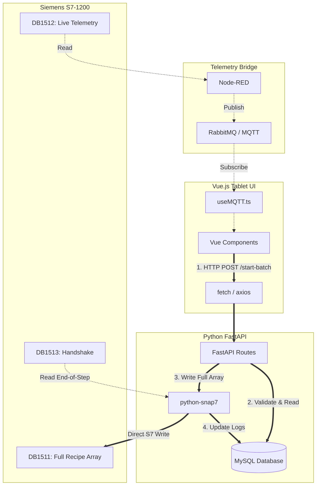

# 🏭 Hybrid Architecture & Full Recipe Workflow

This document outlines the **Hybrid Communication Model** (CQRS) combined with the **Full Recipe Array (DB1511)** concept for the Mixing Control application.

## 🏗️ 1. System Architecture Diagram

---

## 🔄 2. Step-by-Step App Workflow

### Phase A: Starting the Batch (The Command)
1. **Operator Action:** The operator scans a barcode and clicks "Start Production" on the Vue.js tablet.
2. **API Request:** The frontend sends an HTTP `POST /api/production/start` to FastAPI.
3. **Database Assembly:** FastAPI queries `v_sku_complete` to get all 20 steps for that specific SKU.
4. **Data Packing:** FastAPI uses `plc_interface.py` to pack all 20 steps into the binary array structure required by `type_FullRecipe`.
5. **Direct PLC Write:** FastAPI uses `snap7` to write the entire binary array directly to `DB1511` and sets `Cmd_LoadRecipe = True`.
6. **Confirmation:** FastAPI responds to the frontend with `200 OK`. (If the PLC is offline, FastAPI blocks the start and returns a 500 error).

### Phase B: Mixing Execution (The Telemetry)
1. **PLC Takes Over:** The PLC sees `Cmd_LoadRecipe = True`, loads the array, and begins executing `Active_Step = 1`.
2. **Telemetry Streaming:** Node-RED continuously reads `DB1512` every 500ms and publishes to MQTT.
3. **UI Updates:** The Vue.js frontend receives the MQTT payload and updates the temperature gauges, active row highlighting, and timer *instantly*.

### Phase C: Step Completion (The Handshake)
1. **PLC Finishes Step:** The PLC finishes Step 1, pulses `DB1513.Step_Complete`, and instantly moves to Step 2.
2. **Python Background Worker:** A background task in FastAPI (polling `DB1513` via snap7) detects the pulse.
3. **Database Logging:** FastAPI logs the final weight, temperature, and end-time of Step 1 into the SQL database.

---

## 📦 3. Required Application Modules

To build this, you need to structure your app modules like this:

### 🐍 Python Backend (FastAPI)
* **`plc_interface.py` (Update Needed):** 
  * Add a new Pydantic model for `DB1511_FullRecipe` and `DB1511_RecipeStep`.
  * Write the `.serialize()` method to convert the array of steps into S7 byte format.
* **`plc_service.py` (New):**
  * Use `python-snap7` to manage the TCP connection to the PLC.
  * Function: `write_recipe_to_plc(batch_id, steps_array)`
* **`worker_handshake.py` (New):**
  * An `asyncio` background loop that reads `DB1513` (Handshake) every 1 second and writes step completion data to the SQL database.
* **`routes/production.py`:**
  * Endpoint for `POST /start-batch` that triggers the PLC write.

### 🔴 Node-RED (Middleware)
* **Remove DB1510 Logic:** Delete all nodes that currently write to DB1510. Node-RED is no longer responsible for sending recipes.
* **Keep DB1512 Logic:** Keep the S7-Read nodes for DB1512 and publish them to MQTT exactly as they are.

### 🟢 Vue.js Frontend (x3101-0110-frontEnd)
* **`x61-MixingControl.vue`:**
  * When pressing start/next, instead of publishing an MQTT message, call an Axios HTTP POST request to your FastAPI backend.
* **`useMQTT.ts`:**
  * Keep this exactly as it is! It will continue to listen to the telemetry stream to update the UI perfectly.
