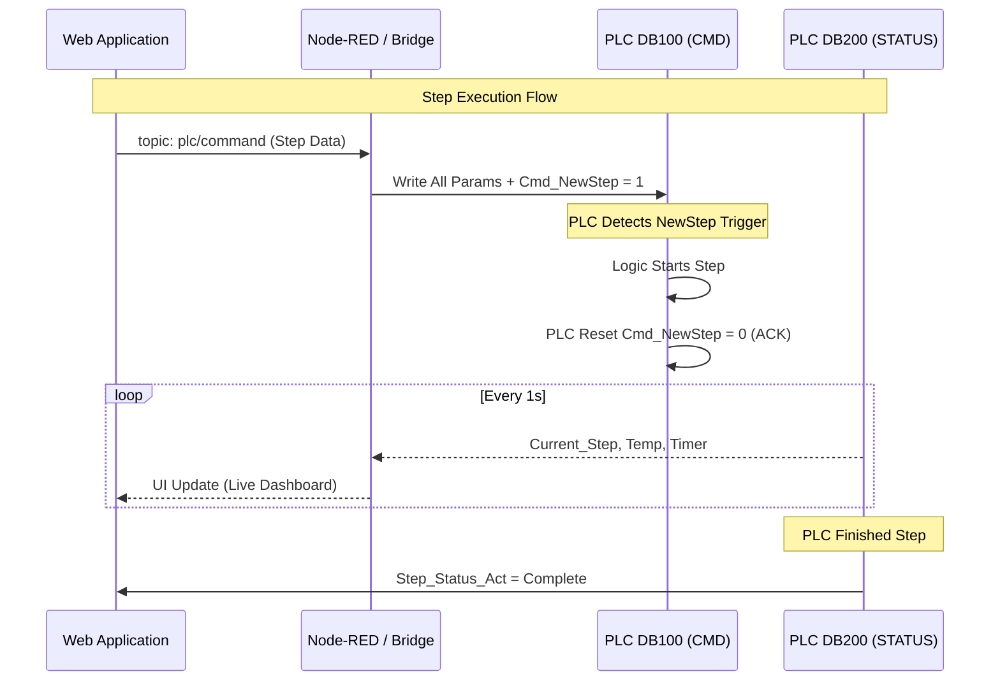

# 🧠 S7-1200 PLC Data Block & Interaction Design 
**Method: Step-by-Step Handshake (via Node-RED & MQTT)**

This document defines the data structures (Data Blocks) used for real-time communication between the HMI/App and the Siemens S7-1200 PLC. 

---

## 📥 DB100: Step Command (App ➔ PLC)
**Role:** Receives recipe parameters and execution commands for the current step. 
**Access:** App writes (via MQTT/Bridge), PLC reads.

| Name | Data Type | Description | Example |
|------|-----------|-------------|---------|
| `Watch_Doc` | Int | Watchdog timer/counter from App | 1234 |
| `Plan_ID` | String[20] | Production Plan Identifier | 'PLAN-2024-001' |
| `Batch_ID` | String[20] | Current Production Batch | 'P260411-02-01' |
| `SKU_Name` | String[30] | Product name or SKU identifier | 'Strawberry_Jam_01' |
| `Phase_ID` | String[10] | Phase identifier code | 'A1010' |
| `Step_ID` | Int | Unique Step ID | 501 |
| `Step_Time_SP` | Int | Target Dwell/Mixing time (seconds) | 600 |
| `Step_Status` | Int | 0=Pending, 1=Active, 2=Complete | 1 |
| `Material_ID` | String[20] | Specific Raw Material ID | 'MAT-099' |
| `Re_Code_ID` | String[20] | Ingredient or Recipe Code | 'RM-SUG-01' |
| `Req_Qty` | Real | Required Quantity for step | 250.5 |
| `TT_SP` | Array[0..16] of Real | Temperature Profile Setpoints | [60.0, 65.0, ...] |
| `Agitator_Speed` | Real | Target Agitator Speed (RPM) | 30.0 |
| `High_Shear_SP` | Real | Target High Shear Speed (RPM) | 1500.0 |
| `PH_Target` | Real | Target pH level | 4.5 |
| `Brix_Target` | Real | Target Brix value | 12.5 |
| `HMI_Command` | Int | 0=IDLE, 1=START, 2=PAUSE, 3=ABORT | 1 |
| `Cmd_NewStep` | Bool | Trigger Flag to start the step | TRUE |

---

## 📤 DB200: Telemetry (PLC ➔ App)
**Role:** Live monitoring and feedback from the physical hardware.
**Access:** PLC writes, App reads (polled or streamed every 1s).

| Name | Data Type | Description | Example |
|------|-----------|-------------|---------|
| `Watchdog` | Int | Heartbeat signal from PLC | 32767 |
| `PLC_State` | Int | 0=Ready, 1=Run, 2=Hold, 9=Error | 1 |
| `Current_Step` | Int | Which step the PLC is actively executing | 5 |
| `Step_Timer` | Int | Elapsed time in current step (seconds) | 124 |
| `Step_Status_Act` | Int | Current Step Phase (e.g., 0=Init, 1=Dosing, 2=Mixing) | 2 |
| `MixTank_Temp` | Real | Live Tank Temperature (°C) | 59.5 |
| `MixTank_Weight` | Real | Live Tank Weight (kg) | 249.8 |
| `Agitator_Act` | Real | Live Agitator Speed (RPM) | 30.1 |
| `HighShear_Act` | Real | Live High Shear Speed (RPM) | 1498.2 |
| `PH_Actual` | Real | Live pH Sensor Reading | 4.52 |
| `Brix_Actual` | Real | Live Brix Sensor Reading | 12.4 |
| `Hopper_Weight` | Real | Live Sub-Hopper Weight (kg) | 0.0 |

---

## 🔄 Interaction Flow (Handshake)

The communication follows a strict handshake protocol to ensure safety in manual and automatic modes.

## 🛠️ Implementation Guidance

1. **Watchdog Logic**: Both the App (DB100) and PLC (DB200) increment their watchdog values. If a side detects that the other side's value hasn't changed for >5 seconds, it should trigger a **Communication Error** and safe-stop any active motor/pump.
2. **String Handling**: S7 strings use the first two bytes for length metadata. The App serialization must account for this (2 bytes + actual string data).
3. **Trigger Reset**: The PLC should reset `Cmd_NewStep` to `FALSE` as soon as it acknowledges the new parameters, serving as a handshake confirmation back to the App.
